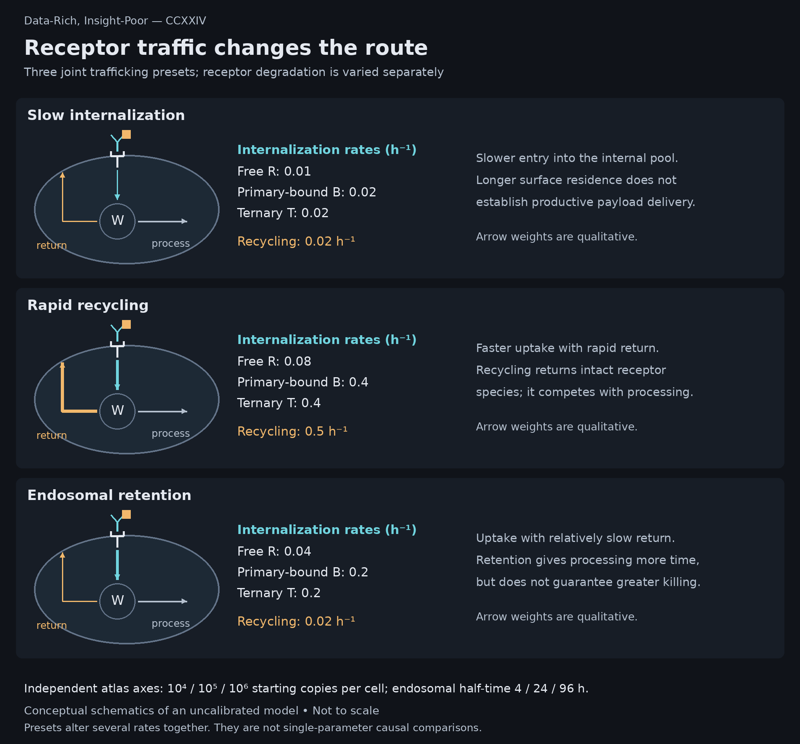
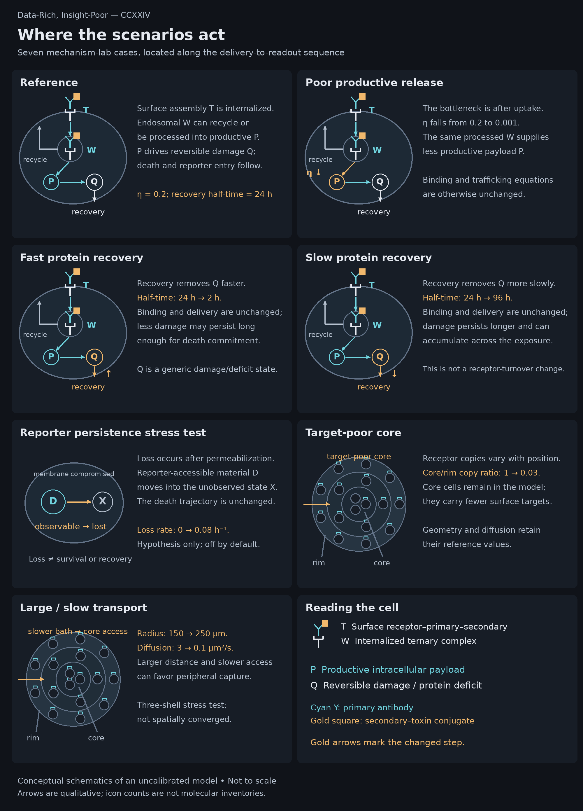
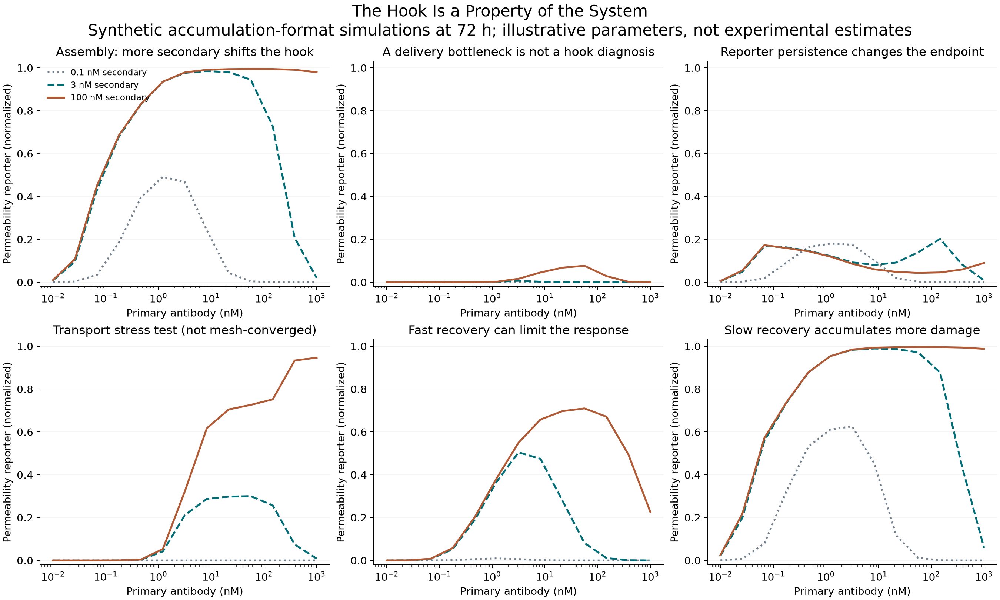
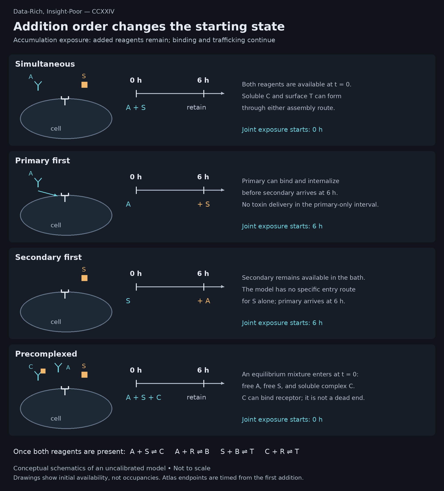
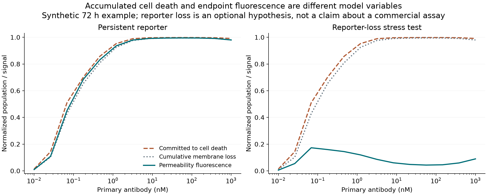

# The Hook Is a Property of the System

Data-Rich, Insight-Poor — CCXXIV

Accumulation-format reference simulations at 72 hours. The curves and molecular inventories are model outputs, not experimental measurements.

A cytotoxicity curve assigns a single response to a sequence of events that need not remain proportional to one another. In the targeted mechanism considered here, receptor engagement, recruitment of a secondary-antibody–toxin conjugate, intracellular processing, and the cellular response to productive payload all contribute to the eventual readout. Each step can alter the relationship between the concentration added and the fluorescence recorded. A high-dose hook exposes the problem: increasing primary antibody produces a smaller endpoint response, potentially despite extensive receptor occupancy.

Here, accumulation denotes an exposure format in which added reagents remain with the organoids throughout the incubation, without intervening reagent removal or medium replacement. Their free concentrations can nevertheless change as binding, transport, and uptake proceed; accumulation does not imply that every molecular inventory or signal increases continuously. The measured endpoint consequently reflects the history of a changing system. If increasing secondary removes the hook, the improved curve could reflect more productive assembly, displacement of the decline beyond the tested primary concentrations, or enough additional exposure to drive a nonlinear death response toward its ceiling. Establishing which of these occurred is the mechanistic problem.

The distinction is substantial even in a deliberately simplified model. At 72 hours, two simulated antibody conditions produce normalized permeability signals of 0.985 and 0.980. On an endpoint plot, they look almost interchangeable. One has delivered 9,724 productive payload equivalents per initial cell; the other, 3,584. Almost the same fluorescence is compatible with approximately 63% less cumulative delivery.

The accompanying [Organoid Hook Model](https://datarichinsightpoor.github.io/organoid-hook-model/) follows this problem from reagent binding through receptor trafficking, intracellular payload, recoverable damage, and membrane-integrity fluorescence. Its 5,304 simulations use illustrative parameters and are not fitted to experimental data. The literature supports individual mechanisms within that sequence; the closest direct hook studies concern homogeneous secondary-labeled binding and internalization, rather than secondary-toxin killing in tumor organoids ([Shembekar et al.](https://pmc.ncbi.nlm.nih.gov/articles/PMC5842027/); [Riedl et al.](https://pmc.ncbi.nlm.nih.gov/articles/PMC4708616/)). The model examines the consequences of joining those mechanisms, including the conditions under which a convincing endpoint becomes a poor guide to delivery.

## Stoichiometry

In an accumulation format, free primary antibody remains available to bind the secondary conjugate in solution while receptor-bound primary recruits it at the cell surface. A homogeneous internalization assay developed by Riedl and colleagues showed a prozone effect at excess primary and discussed depletion of the secondary probe; its Fab secondary was chosen to avoid cross-linking effects ([Riedl et al.](https://pmc.ncbi.nlm.nih.gov/articles/PMC4708616/)). Shembekar and colleagues reported a related hook in homogeneous cell-binding fluorescence and considered increasing labeled secondary as a remedy, with a corresponding background cost ([Shembekar et al.](https://pmc.ncbi.nlm.nih.gov/articles/PMC5842027/)). These observations make reagent partitioning a credible mechanism, although neither study establishes how a multivalent toxin conjugate behaves in a living organoid.

The simplest useful model allows primary antibody to bind receptor and secondary independently. It also allows a soluble primary–secondary complex to bind receptor. Excluding that last route would make solution-phase binding an irreversible waste of reagent and produce a convenient explanation by stipulation. Here, soluble complex remains competent to contribute to surface assembly; the hook emerges because finite secondary is distributed over an increasing primary population, while primary without secondary competes for the same receptors.

The equilibrium limit makes that competition explicit. In a uniform compartment with effective 1:1:1 binding and negligible depletion of soluble ligands by receptor, the soluble primary–secondary complex, \(C_{\mathrm{eq}}\), determines the surface ternary complex, \(T_{\mathrm{eq}}\):

\[
\begin{aligned}
C_{\mathrm{eq}}&=\frac{\Sigma-\sqrt{\Sigma^2-4A_0S_0}}{2},\\[6pt]
T_{\mathrm{eq}}&=\frac{R_0\,C_{\mathrm{eq}}}{K_A+A_0}.
\end{aligned}
\]

Here \(A_0\) and \(S_0\) are total primary and secondary concentrations, \(R_0\) is total surface receptor concentration, and \(K_A\) and \(K_S\) are the primary–receptor and primary–secondary dissociation constants; \(\Sigma=A_0+S_0+K_S\) abbreviates their sum in the soluble binding balance. All of these variables, constants, and complex concentrations use the same concentration units. The first relationship accounts for finite secondary supply; the second accounts for competition at the receptor. At large primary excess, \(C_{\mathrm{eq}}\) approaches \(S_0\), while the competing primary concentration continues to rise. The limiting behavior is therefore particularly simple:

\[
T_{\mathrm{eq}}\sim\frac{R_0S_0}{A_0}
\qquad (A_0\gg S_0,K_A,K_S).
\]

Surface delivery-competent complex declines approximately in inverse proportion to primary concentration even as receptor occupancy approaches saturation. Saturating the target and supplying it with secondary conjugate have become progressively less equivalent.

This is an assembly hook without an imposed bell-shaped response function. Its maximum shifts to higher primary concentration when secondary is increased, so a titration can become monotonic over the sampled range without abolishing the high-primary decline. General analyses of linker-mediated assembly also show that cooperativity can modify hook behavior, a reminder that the independent-binding approximation will not capture every conjugate format ([Dutta Roy et al.](https://pmc.ncbi.nlm.nih.gov/articles/PMC5556679/)). The [complete derivation](https://datarichinsightpoor.github.io/organoid-hook-model/equations.html) gives the peak position and the conservation equations required when receptor-mediated depletion can no longer be neglected.

The numerical example makes the distinction between occupancy and productive assembly unusually clear. With 100,000 initial surface receptors per cell, simultaneous addition of 8.254 nM primary and 3 nM secondary yields the 0.985 fluorescence endpoint described above. At 1,000 nM primary with the same secondary concentration, modeled occupancy of the remaining surface receptor pool is approximately 99.9%, yet fluorescence falls to 0.020. Increasing secondary to 100 nM raises that signal to 0.980. Cumulative productive delivery, however, reaches only 3,584 equivalents per initial cell, compared with 9,724 in the lower-primary reference condition. Receptor occupancy was already high in the poorly killing condition; what changed was the fraction of occupied receptors carrying secondary and the exposure subsequently accumulated.

The apparent rescue therefore contains two effects: improved assembly and compression of the remaining delivery difference by the downstream response. Near its upper limit, fluorescence has little room left to report how much further one condition has progressed along the delivery pathway. A comparison based only on that endpoint would discard most of the mechanistic difference.

## Receptor turnover and productive delivery

Surface abundance constrains how much antibody can bind at a given instant. Sustained delivery also depends on internalization, recycling, receptor replacement, intracellular processing, and access of the active species to its site of action, processes that need not covary with surface expression ([Ritchie et al.](https://pmc.ncbi.nlm.nih.gov/articles/PMC3564878/)). The model therefore gives free receptor, primary-bound receptor, and ternary complex separate internalization rates. Internalized material can recycle or enter a degradative pathway, while synthesis maintains the specified receptor abundance before treatment.

An intracellular measurement is informative only to the extent that its compartment is known. The pH-activated assay described by Riedl and colleagues detects acidified compartments but does not uniquely establish lysosomal routing; recycling further complicates interpretation of the accumulated signal ([Riedl et al.](https://pmc.ncbi.nlm.nih.gov/articles/PMC4708616/)). A more specific demonstration of the distinction comes from Tomabechi and colleagues, who showed transport of the T-DM1 catabolite Lys-SMCC-DM1 by SLC46A3 and attenuation of T-DM1 cytotoxicity by potent transporter inhibitors ([Tomabechi et al.](https://pmc.ncbi.nlm.nih.gov/articles/PMC9896951/)). That result cannot assign an escape mechanism to a protein toxin. It does establish why delivery to an intracellular compartment and productive access beyond that compartment must remain separate variables.

Within each model shell, the current productive payload inventory follows

\[
\frac{dP}{dt}=\eta d\,k_{\mathrm{deg}}W_c-k_PP.
\]

\(W_c\) is the endosomal ternary-complex inventory in copies per initial cell, \(k_{\mathrm{deg}}\) is its processing rate, \(d\) is the effective payload yield per secondary conjugate, and \(\eta\) is the fraction becoming productive intracellular payload. \(P\) is the current productive inventory in equivalents per initial cell, \(t\) is time in hours, and \(k_P\) is its first-order loss rate; both rate constants have units of inverse hours. The source term, \(\eta d\,k_{\mathrm{deg}}W_c\), is the delivery flux. Integrating that term gives cumulative delivery, whereas the inventory \(P\) also subtracts what has been lost. This is a deliberately coarse representation of processing and access, with no claim that the same route applies to every toxin.

At 24 hours in the reference simulation, the population-weighted delivery flux is approximately 160 equivalents per initial cell per hour, while payload loss is 87. The current inventory is therefore increasing by about 73 equivalents per initial cell per hour and contains approximately 1,510 equivalents. The fluorescence signal is only 0.213 because damage accumulation, death commitment, and membrane permeabilization have their own kinetics. A payload measurement at that time and an endpoint fluorescence measurement answer different questions even when both are technically accurate.

The meaning of turnover also depends on which pool is turning over. The receptor parameter exposed in the atlas is the degradation half-time of retained endosomal receptor in the absence of recycling, rather than the measured half-life of the whole cellular receptor pool. Maintaining the same starting surface abundance while changing that rate requires a different synthesis flux. Comparisons described simply as “equal receptor expression” can therefore impose unequal replacement capacity within the model.

Figure 1. The receptor atlas compares three joint trafficking presets, not three isolated changes in one rate. The cellular sketches follow the internalized ternary complex; analogous internalization and recycling terms apply to free and primary-bound receptor. Initial surface copies and the conditional degradation half-time of retained endosomal receptor are independent atlas axes. Arrow weights are qualitative, and the simplified drawings omit synthesis and other unchanged terms. [Open the full-resolution schematic](https://datarichinsightpoor.github.io/organoid-hook-model/figures/cell-trafficking.png).

Downstream recovery is represented separately as a generic reversible damage or protein-deficit state. In the reference case, sufficient damage persists to produce near-complete killing across a broad dose range. Shortening its recovery half-time from 24 to 2 hours leaves a substantial hook even at 100 nM secondary: the highest-primary fluorescence is approximately 0.226 against a sampled maximum of 0.710. Faster recovery does not create the upstream assembly deficit; it prevents that deficit from being hidden by accumulated killing. Conversely, when productive release is too poor to generate appreciable damage at any dose, a flat low curve provides no evidence that the assay has been rescued.

Figure 2. Each mechanism-lab scenario changes a specified part of the model relative to the reference case. T and W denote surface and internalized ternary complex; P is productive payload and Q is the generic reversible damage or protein-deficit state. The processing arrow combines several unresolved biological steps and assigns no toxin-specific route or intracellular target. Recovery is removal of Q, not export of payload from the cell. In the tissue sections, circles represent cells and cyan marks represent surface targets; their counts are illustrative, not proportional to receptor abundance, and core cells are retained in the target-poor case. Reporter loss moves already permeabilized material from an observable to an unobserved state, without restoring survival. All panels are conceptual, not calibrated predictions. [Open the full-resolution schematic](https://datarichinsightpoor.github.io/organoid-hook-model/figures/cell-scenarios.png).

Figure 3. Accumulation-format simulations at 72 hours. The transport stress case is not spatially converged and is included to expose sensitivity to tissue geometry, not to predict penetration quantitatively.

## Spatial competition

Treating receptor copy number as a whole-well scalar misses a second consequence of binding. Ackerman and colleagues experimentally examined how antigen expression and turnover affect antibody penetration into tumor spheroids, showing why a strong peripheral binding sink can restrict access to deeper tissue ([Ackerman et al.](https://pmc.ncbi.nlm.nih.gov/articles/PMC2831054/)). In that setting, increasing receptor abundance can favor local uptake while worsening its spatial distribution. The nominal bath concentration cannot specify both.

The converse is important. Kopp and colleagues used affinity-modulated carrier antibodies to improve the distribution of an ADC surrogate in high-expression spheroids while limiting competition in low-expression cells, then examined the strategy in vivo with ADCs ([Kopp et al.](https://pmc.ncbi.nlm.nih.gov/articles/PMC12964248/)). These are different reagents and experimental systems from an indirect secondary-toxin assay. Nevertheless, they provide an empirical counterweight to the assumption that receptor competition must always reduce useful delivery. Partial occupation of accessible binding sites can permit deeper penetration; its net effect depends on whether peripheral capture or insufficient cellular uptake was more limiting.

The simulator couples a finite bath to concentric tissue shells and allows free primary, free secondary, and soluble complex to diffuse separately. Binding consumes local soluble material, and intercompartmental transfer conserves its amount. Receptor expression can differ between rim and core. The three-shell representation is adequate for exploring these competing effects, but its numerical adequacy must be checked for each regime: increasing resolution to twelve shells changes reference fluorescence only slightly, whereas the large-organoid, slow-transport stress case changes substantially and nonmonotonically. That case cannot support a quantitative claim about penetration depth.

Order of addition introduces a related ambiguity in time. A delayed-secondary condition read 72 hours after the first addition has less joint exposure than a simultaneous condition read at the same clock time. The repository compares both endpoints anchored to the first addition and endpoints aligned to the availability of both reagents. Much of the apparent secondary-first delay effect in the reference simulation diminishes under the latter comparison. A claim about addition order should survive separating the order itself from the duration during which productive assembly was possible.

Figure 4. Addition order specifies initial availability, not an irreversible assembly route. A is primary antibody, S is secondary–toxin conjugate, C is soluble A–S complex, R is free receptor, B is receptor–primary complex, and T is receptor–primary–secondary complex. Once both reagents are present, all four reversible binding routes remain available. Delayed addition is six hours in the committed browser atlas; the Python implementation permits other delays. Precomplexing initializes an equilibrium bath mixture containing free species and complex, not complete complexation or a specified premixing duration. Reagents are retained throughout, while their free concentrations evolve. [Open the full-resolution schematic](https://datarichinsightpoor.github.io/organoid-hook-model/figures/cell-addition-orders.png).

## Fluorescence and exposure history

CellTox Green reports DNA accessibility after membrane compromise, according to its technical definition, rather than receptor binding or intracellular payload ([CellTox Green technical manual](https://www.promega.com/resources/protocols/technical-manuals/101/celltox-green-cytotoxicity-assay-protocol/)). Other viability methods interrogate metabolism, membrane integrity, or related cell properties through different measurement processes ([Madorran et al.](https://pmc.ncbi.nlm.nih.gov/articles/PMC11719996/)). Treating their outputs as interchangeable percentages assumes the biological relationships that an orthogonal assay is supposed to test.

Lewis and colleagues made this issue concrete by comparing CellTox Green, LDH, MTS, and CellTiter-Glo in human intestinal organoid-derived cultures ([Lewis et al.](https://pmc.ncbi.nlm.nih.gov/articles/PMC11164375/)). For ritonavir in one line, the estimated CC50 was 68 μM by LDH and 73 μM by CellTox, compared with 139 μM by ATP and a value above 158 μM by MTS because the response had not crossed 50% within the tested range ([Lewis et al.](https://pmc.ncbi.nlm.nih.gov/articles/PMC11164375/)). The study was primarily in intestinal monolayers, with a limited 3D comparison, and explicitly left broader generalization across drugs and organoid formats unresolved ([Lewis et al.](https://pmc.ncbi.nlm.nih.gov/articles/PMC11164375/)). Its relevance is the experimentally demonstrated dependence of the reported response on both the culture and the assay, not a transferable correction factor for tumor organoids.

Repeated measurements also separate events that an endpoint combines. Forcina and colleagues used STACK to resolve the onset and subsequent rate of population cell death, finding substantially different kinetics among compounds with similar overall lethality ([Forcina et al.](https://pmc.ncbi.nlm.nih.gov/articles/PMC5509363/)). In the present model, cells accumulate damage, become committed to death, and then become membrane-permeable after a delay. The connection to fluorescence becomes clearer when written as an integral over that history. With no initial reporter-accessible material and a linear observation process, the normalized signal is

\[
F(t)=\sum_j\omega_j
\int_0^t r_j(u)\,e^{-k_{\mathrm{loss}}(t-u)}\,du.
\]

The index \(j\) identifies a tissue shell, and \(u\) is the earlier time at which cells became permeable. The entry rate \(r_j(u)\), measured as a fraction of that shell's initial cells per hour, equals \(k_{\mathrm{perm}}E_j(u)\): \(E_j\) is the fraction committed to death but not yet permeable, and \(k_{\mathrm{perm}}\) is the first-order permeabilization rate in inverse hours. The normalized optical weight \(\omega_j=w_jo_j/\sum_\ell w_\ell o_\ell\) combines the shell's initial-cell fraction \(w_j\) with its relative optical contribution \(o_j\); \(\ell\) runs over the same shells. Finally, \(k_{\mathrm{loss}}\) is the first-order loss rate of reportable material. Thus \(F\) is dimensionless and referenced to complete, persistent permeabilization of the initial population, rather than calibrated fluorescence units.

With \(k_{\mathrm{loss}}=0\), every past entry into the permeable state retains equal weight within its shell. Fluorescence accumulates a record of membrane compromise, even after the intracellular payload responsible for it has declined. A positive loss rate progressively discounts older events. The equation separates two histories that an endpoint otherwise conflates: when cells became permeable and how much of that event remains observable at the time of reading.

Reporter persistence introduces another possible source of nonmonotonicity. In an optional simulation, approximately 99% of the initial population has committed to death at the highest primary concentration, while normalized fluorescence is only about 9%, because reportable material has been allowed to disappear after permeabilization. Earlier killing leaves more time for that loss. The same death trajectory therefore produces different endpoint curves depending on whether the reporter remains observable.

There is a relevant precedent, with an important boundary. Forcina and colleagues observed occasional declines in SYTOX Green-positive object counts, attributed most likely to marker loss from long-dead cells, and incorporated a correction into their lethal-fraction analysis ([Forcina et al.](https://pmc.ncbi.nlm.nih.gov/articles/PMC5509363/)). This involved a different dye and counted objects rather than whole-well fluorescence. It motivates measuring persistence in the assay of interest, but supplies neither evidence of CellTox Green decay nor a loss constant for this model. Reporter loss remains off by default. Monotonic detector saturation is a separate issue: it can conceal differences or flatten an increasing response, but cannot by itself reverse the direction of a monotonic input.

Figure 5. Cumulative death commitment, membrane permeabilization, and fluorescence with reporter loss disabled or enabled. The loss scenario changes the observation process without changing the underlying killing trajectory.

Extending the analysis to ATP requires more than replacing the reporter equation. Hafner and colleagues showed that conventional endpoint drug-response metrics depend on the number of divisions during an assay and introduced growth-rate inhibition metrics to address that confounding ([Hafner et al.](https://pmc.ncbi.nlm.nih.gov/articles/PMC4887336/)). The current simulator contains no proliferation. Its ATP-like, LDH-like, and committed-state readouts are alternative observations of a fixed initial population, not calibrated commercial assays or growth-rate-corrected sensitivity estimates.

## Discriminating mechanisms

The useful next measurement depends on what the proposed explanation must account for. If secondary limitation is dominant, increasing secondary should alter surface ternary assembly as well as the final response. If assembly improves while intracellular payload remains inadequate, trafficking and productive processing become the more informative quantities. A spatial explanation requires evidence of redistribution between accessible and poorly reached cells; a bulk increase in antibody uptake is insufficient. A reporter explanation requires divergence between the independently measured biological trajectory and the material that remains observable.

A primary-by-secondary concentration matrix, paired with time-resolved assembly, delivery, and cell-state measurements, would therefore constrain more than a dense primary titration read once. Target-negative, primary-only, and secondary-only conditions are particularly consequential because nonspecific uptake and toxicity are absent from the model. A secondary-only signal cannot be accommodated honestly by adjusting receptor affinity. Similarly, a failure of the model's predicted shift in the assembly maximum would challenge the independent-binding approximation before any downstream death parameter needed to be fitted.

Some mismatches will require a different model. Effective 1:1:1 binding omits cross-linking and avidity; there is no aggregate distribution, extracellular cleavage, bystander payload transport, growth, or changing tissue geometry. Trafficking also continues on a fixed initial-cell population after death commitment, which can overestimate late delivery. The reported molecular inventories are consequently per initial cell, not per surviving cell. These limitations matter especially when an endpoint approaches complete killing, precisely where continued modeled delivery becomes least biologically secure.

## Calibration and prediction

The model is uncalibrated: its parameter values have not been estimated against matched experimental measurements from a defined antibody, conjugate, receptor, and organoid system. The reported hook positions, delivery inventories, and fluorescence values are therefore conditional consequences of the chosen assumptions, not quantitative predictions for a particular assay. The 5,304 simulations explore that assumed system; their number does not supply experimental support for it. The software tests address mathematical bookkeeping and numerical behavior, leaving the biological accuracy of the inputs and structure to experimental evaluation.

Calibration would begin by constraining the model with measurements that distinguish its stages: accessible receptor copies, binding and complex formation, trafficking and intracellular processing, and time-resolved cell-state and reporter responses. Independently measured quantities would set inputs or defensible bounds; the remaining parameters would be estimated jointly from complementary observations across concentrations and times, with measurement error and preparation-to-preparation variability carried into the uncertainty analysis. A fluorescence titration alone would leave important ambiguities. In this model, for example, payload yield and productive-release efficiency enter the delivery term as a product; even excellent agreement with the final curve cannot identify them separately without additional information. Where the data constrain only such a combination, that combination should be reported rather than assigning unwarranted precision to its components.

A calibrated fit would still require validation against observations withheld from parameter estimation, preferably including independent organoid preparations and exposure conditions. The relevant test is whether the model predicts those responses, with useful uncertainty bounds, without being readjusted to each result. Persistent, structured errors would call for revisiting the model's biology, observation process, or spatial resolution before further parameter tuning. This progression could support quantitative use within a defined experimental domain; it would not establish that the inferred mechanism is unique or that the same calibration transfers to another receptor, conjugate, or assay.

## The tool

The [Organoid Hook Model](https://datarichinsightpoor.github.io/organoid-hook-model/) makes the sequence examined in this article accessible in a browser, without installation. Its underlying Python implementation solves coupled differential equations for antibody binding, receptor internalization and recycling, intracellular processing, productive payload, recoverable damage, and transitions toward membrane compromise. A finite external bath exchanges material with three concentric organoid shells, allowing local receptor abundance and tissue access to influence delivery. Fluorescence and the alternative assay proxies are calculated from those evolving states through separate observation equations.

The browser offers two complementary views. The receptor atlas compares selected receptor copy numbers, trafficking behaviors, endosomal degradation half-times, addition orders, and observation times across primary and secondary concentrations. The mechanism lab examines specified changes in transport, core expression, productive release, downstream recovery, or reporter persistence. Switching the plotted quantity from fluorescence to surface complex, intracellular payload, or cumulative delivery exposes where two apparently similar response curves cease to agree. Exact values, parameter files, and chart exports make those comparisons inspectable beyond the screen.

For a first pass, [Follow one simulation](https://datarichinsightpoor.github.io/organoid-hook-model/#follow-one-simulation) traces a fixed reference system across six time points and three reagent conditions. It connects the initial receptor inventory to surface assembly, intracellular delivery, damage, death commitment, and fluorescence, with downloadable trajectories and a reproduction script. This walkthrough is independent of the main explorer controls; its purpose is to make the molecular accounting explicit before introducing the larger parameter space. The [worked example](https://datarichinsightpoor.github.io/organoid-hook-model/worked-example.html) supplies the numerical substitutions, while the [mathematical specification](https://datarichinsightpoor.github.io/organoid-hook-model/equations.html) defines the full equations, variables, units, and assumptions.

The [source code on GitHub](https://github.com/dataRichinsightPoor/organoid-hook-model) includes the Python solver, editable parameter examples, a notebook, automated tests, simulation outputs, and the public-source audit. The browser displays 5,304 precomputed simulations from that implementation; it does not solve new parameter combinations, interpolate between scenarios, or fit an experimental curve. Readers who want to change continuous parameters, exposure duration, or addition delays can run the Python package and generate new trajectories. Keeping the executable model and its assumptions available alongside the figures makes it possible to test how an interpretation depends on the choices that produced it.

The nearly superimposable endpoints in the opening example would be easy to describe as equivalent killing. They would be poor evidence of equivalent delivery, and weaker evidence still that the two conditions would remain equivalent after changing receptor turnover, recovery, exposure duration, or tissue access. Increasing secondary can be a useful perturbation. Its interpretation depends on following the response far enough upstream to establish what was actually restored.

## References

1. Riedl T, van Boxtel E, Bosch M, Parren PWHI, Gerritsen AF. High-Throughput Screening for Internalizing Antibodies by Homogeneous Fluorescence Imaging of a pH-Activated Probe. Journal of Biomolecular Screening. 2016;21:12–23. doi:10.1177/1087057115613270. [Full text](https://pmc.ncbi.nlm.nih.gov/articles/PMC4708616/).

2. Shembekar N, Hu H, Eustace D, Merten CA. Single-Cell Droplet Microfluidic Screening for Antibodies Specifically Binding to Target Cells. Cell Reports. 2018;22:2206–2215. doi:10.1016/j.celrep.2018.01.071. [Full text](https://pmc.ncbi.nlm.nih.gov/articles/PMC5842027/).

3. Dutta Roy R, Rosenmund C, Stefan MI. Cooperative binding mitigates the high-dose hook effect. BMC Systems Biology. 2017;11:74. doi:10.1186/s12918-017-0447-8. [Full text](https://pmc.ncbi.nlm.nih.gov/articles/PMC5556679/).

4. Ritchie M, Tchistiakova L, Scott N. Implications of receptor-mediated endocytosis and intracellular trafficking dynamics in the development of antibody drug conjugates. mAbs. 2013;5:13–21. doi:10.4161/mabs.22854. [Full text](https://pmc.ncbi.nlm.nih.gov/articles/PMC3564878/).

5. Tomabechi R, Kishimoto H, Sato T, Saito N, Kiyomiya K, Takada T, Higuchi K, Shirasaka Y, Inoue K. SLC46A3 is a lysosomal proton-coupled steroid conjugate and bile acid transporter involved in transport of active catabolites of T-DM1. PNAS Nexus. 2022;1:pgac063. doi:10.1093/pnasnexus/pgac063. [Full text](https://pmc.ncbi.nlm.nih.gov/articles/PMC9896951/).

6. Ackerman ME, Pawlowski D, Wittrup KD. Effect of antigen turnover rate and expression level on antibody penetration into tumor spheroids. Molecular Cancer Therapeutics. 2008;7:2233–2240. doi:10.1158/1535-7163.MCT-08-0067. [Full text](https://pmc.ncbi.nlm.nih.gov/articles/PMC2831054/).

7. Kopp A, Dong S, Kwon H, Wang T, Desai AA, Philippart A, Koo DJ, Linderman JJ, Tessier PM, Thurber GM. In vivo Auto-tuning of Antibody-Drug Conjugate Delivery to Maximize Efficacy using High-Avidity, Low-Affinity Antibodies. Molecular Cancer Therapeutics. 2026;25:610–621. doi:10.1158/1535-7163.MCT-25-0576. [Full text](https://pmc.ncbi.nlm.nih.gov/articles/PMC12964248/).

8. Lewis MA, Patil K, Ettayebi K, Estes MK, Atmar RL, Ramani S. Divergent responses of human intestinal organoid monolayers using commercial in vitro cytotoxicity assays. PLOS ONE. 2024;19:e0304526. doi:10.1371/journal.pone.0304526. [Full text](https://pmc.ncbi.nlm.nih.gov/articles/PMC11164375/).

9. Forcina GC, Conlon M, Wells A, Cao JY, Dixon SJ. Systematic Quantification of Population Cell Death Kinetics in Mammalian Cells. Cell Systems. 2017;4:600–610.e6. doi:10.1016/j.cels.2017.05.002. [Full text](https://pmc.ncbi.nlm.nih.gov/articles/PMC5509363/).

10. Hafner M, Niepel M, Chung M, Sorger PK. Growth rate inhibition metrics correct for confounders in measuring sensitivity to cancer drugs. Nature Methods. 2016;13:521–527. doi:10.1038/nmeth.3853. [Full text](https://pmc.ncbi.nlm.nih.gov/articles/PMC4887336/).

11. Madorran E, Ambrož M, Knez J, Sobočan M. An Overview of the Current State of Cell Viability Assessment Methods Using OECD Classification. International Journal of Molecular Sciences. 2025;26:220. doi:10.3390/ijms26010220. Published online December 30, 2024. [Full text](https://pmc.ncbi.nlm.nih.gov/articles/PMC11719996/).
